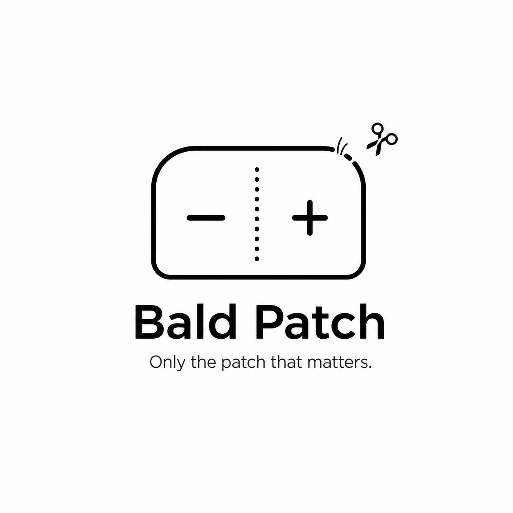

# Bald Patch



Only the patch that matters.

Bald Patch is a Codex-native anti-overbuild project for producing smaller, safer, easier-to-review agent patches. It is not a code generator and it is not a promise that fewer lines are always better. The goal is to help coding agents solve the requested problem while avoiding dependency bloat, speculative abstractions, unrelated rewrites, and review-hostile diffs.

## Project Description

Bald Patch is useful only if it can prove this claim:

> Bald Patch produces smaller, safer, easier-to-review Codex patches without increasing failure rate, agent overhead, or human rework beyond an acceptable threshold.

The first milestone is therefore an evaluation loop, not a marketplace plugin. We start by measuring patch quality and overhead before adding stronger agent rules.

## Principles

- Small patches are good only when correctness and safety stay intact.
- Standard library, platform-native behavior, and existing project utilities come before new dependencies.
- No abstraction should be added unless it pays for itself in the current change.
- A smaller diff with more human rework is a failure.
- Every new Bald Patch rule must map to an eval task that proves its value and a safety task that checks its downside.

## What M1 Builds

M1 is a 10-task A/B smoke evaluation:

- Baseline Codex vs Bald Patch-guided runs.
- Patch metrics: files touched, new files, lines added/deleted, package and lockfile changes.
- Scope lint warnings: dependency changes, lockfile churn, multi-surface edits, and suspicious abstraction names.
- Blind review template for human preference checks.
- JSONL run records and Markdown reports.

M1 success criteria:

| Metric | Threshold |
| --- | ---: |
| Correctness | Not worse than baseline |
| Median LOC changed | Down 20% or more |
| Unnecessary dependency additions | Down 50% or more |
| Tool calls | Median increase no more than 15% |
| Blind reviewer preference | 60% or more prefer Bald Patch |

If M1 fails, the next step is to improve the rule or skill design. It is not to add hooks, plugins, or broader automation.

## Repository Layout

```text
docs/
  design.md
  implementation-plan.md
evals/
  tasks/
    real/
    traps/
  runs/
  reports/
  blind-review-template.md
scripts/
  collect-diff-metrics.mjs
  scope-lint.mjs
test/
```

## Local Commands

```bash
npm test
node scripts/collect-diff-metrics.mjs --base main --json
node scripts/scope-lint.mjs --base main --json
node scripts/baldpatch-review.mjs --base main
node scripts/run-ab.mjs --jsonl
node scripts/score-run.mjs --input evals/runs/2026-06-17.jsonl --output evals/reports/2026-06-17.md
```

The scripts use only Node.js built-ins. No production dependencies are required for M1.

## Eval Run Records

`score-run` reads JSONL run records and renders a deterministic Markdown report:

```json
{"run_id":"2026-06-17-task-001-baseline","task_id":"native-date-picker","arm":"baseline","success":true,"tests_passed":true,"requirements_met":true,"files_changed":4,"lines_added":70,"lines_deleted":10,"dependencies_added":["date-picker-lib"],"tool_calls":10,"elapsed_ms":100000,"scope_violations":["dependency-file-changed"],"human_rework_minutes":2,"reviewer_preferred":false}
{"run_id":"2026-06-17-task-001-skill","task_id":"native-date-picker","arm":"skill","success":true,"tests_passed":true,"requirements_met":true,"files_changed":2,"lines_added":12,"lines_deleted":4,"dependencies_added":[],"tool_calls":11,"elapsed_ms":95000,"scope_violations":[],"human_rework_minutes":1,"reviewer_preferred":true}
```

The report includes by-arm success, median files, median LOC, dependency additions, tool calls, elapsed time, scope warnings, reviewer preference, hard gate failures, and regression warnings.

See [docs/eval-runbook.md](docs/eval-runbook.md) for the honest M1 A/B flow. `run-ab` creates the 20-run queue; it does not pretend those model runs have already happened.

## Codex Skill

The first explicit skill lives at `.agents/skills/baldpatch-patch/SKILL.md`.

Use it when you want Bald Patch guidance for a specific task:

```text
$baldpatch-patch Fix the parser edge case with the smallest safe diff.
```

The skill is intentionally explicit rather than always-on. That keeps the default instruction surface small and lets the M1 eval compare baseline runs against guided runs.

The advisory review skill lives at `.agents/skills/baldpatch-review/SKILL.md` and can be invoked after a patch:

```text
$baldpatch-review Audit this patch for avoidable overengineering.
```

## Installation And Hooks

See [docs/installation.md](docs/installation.md) for the current docs-first installation path. See [docs/hooks.md](docs/hooks.md) for the optional non-blocking Stop hook.

## Roadmap

1. M1: deterministic evaluation scaffolding and 10-task smoke eval.
2. M1: JSONL scoring and Markdown report generation.
3. M2: `$baldpatch-patch` skill draft and A/B comparison against baseline.
4. M3: `$baldpatch-review` review pass with human-reviewed findings.
5. M4: optional non-blocking Codex Stop hook for concise diff metrics.
6. M5: plugin packaging only after the evaluation shows human value.

## References

- [Codex AGENTS.md](https://developers.openai.com/codex/guides/agents-md)
- [Codex skills](https://developers.openai.com/codex/skills)
- [Codex hooks](https://developers.openai.com/codex/hooks)
